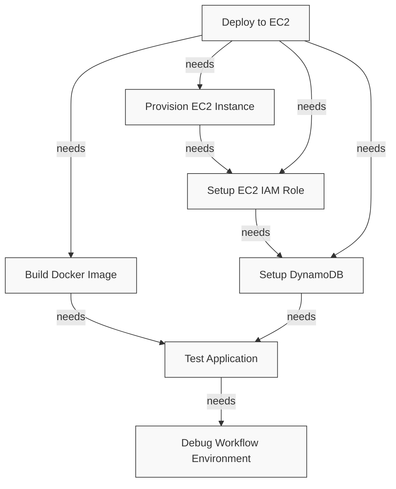

# GitHub Actions Workflow Dependency Check

This document outlines the job dependencies in our workflow to ensure all stages run in the correct order.

## Job Dependencies Visualization



## Pre-Run Checklist

Before running the workflow, verify these dependencies are correctly set up:

1. **Repository Structure**:
   - ✅ `solar-system-main` directory exists with application code
   - ✅ `.github/workflows/solar-system-ec2.yml` is present and valid

2. **AWS Resources**:
   - ✅ IAM user with necessary permissions 
   - ✅ EC2 key pair created in the correct region
   - ✅ Sufficient AWS account quotas for EC2, IAM, and DynamoDB

3. **GitHub Secrets**:
   - ✅ `AWS_ACCESS_KEY_ID`
   - ✅ `AWS_SECRET_ACCESS_KEY`
   - ✅ `AWS_REGION`
   - ✅ `EC2_KEY_NAME`
   - ✅ `EC2_USERNAME`
   - ✅ `EC2_SSH_KEY`

## Job Execution Order

The workflow follows this sequence:
1. Debug job validates environment and secrets
2. Test job runs application tests
3. Setup DynamoDB job creates and populates the database
4. Setup EC2 IAM Role job creates required IAM resources
5. Provision EC2 job deploys the infrastructure
6. Deploy job sends the application to EC2

## Manual Step Triggering (For Troubleshooting)

If you need to manually troubleshoot a specific part of the workflow:

1. Set `demo-mode: true` when triggering the workflow
2. Use the debug job output to verify environment configuration
3. Examine job logs to identify where failures occur
4. For CloudFormation failures, check the AWS console events

## Common Troubleshooting Steps

1. **Missing IAM Instance Profile**:
   ```bash
   aws iam get-instance-profile --instance-profile-name SolarSystemInstanceProfile-development
   ```

2. **Validation of EC2 Key Pair**:
   ```bash
   aws ec2 describe-key-pairs --key-names YOUR_KEY_NAME
   ```
